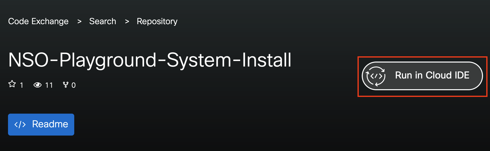
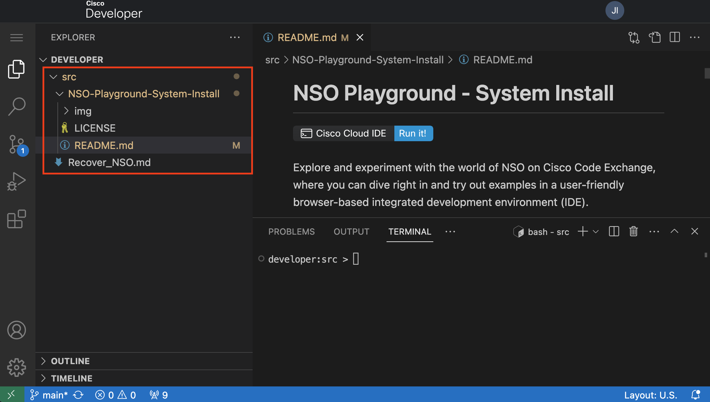
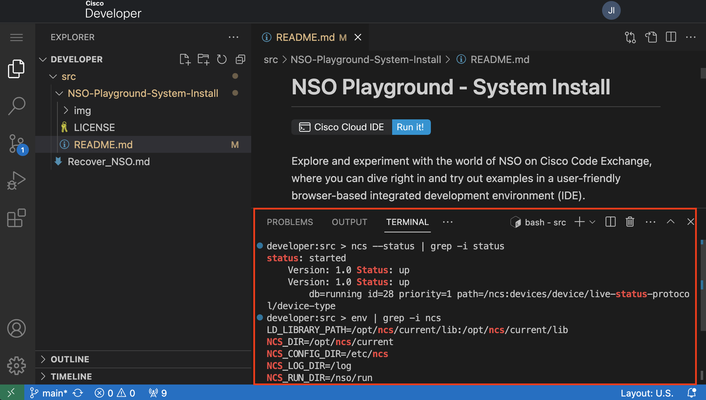
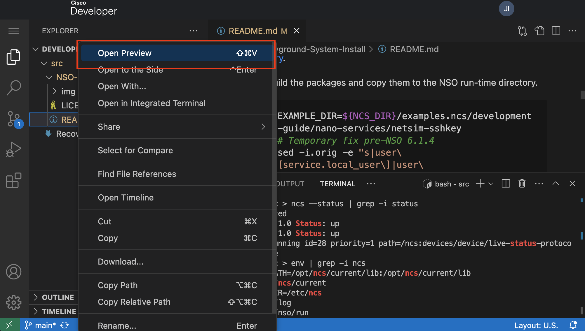
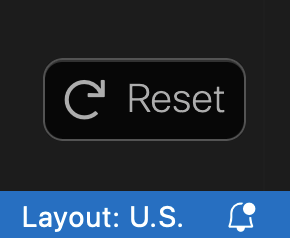

# NSO Playground - System Install

[](https://developer.cisco.com/codeexchange/devenv/CiscoDevNet/NSO-Playground-System-Install)

Explore and experiment with the world of NSO on Cisco Code Exchange, where you can dive right in and try out examples in a user-friendly browser-based integrated development environment (IDE).

But wait, there's more! You can also contribute your examples and share them with everyone. The best part is your peers can play with your examples without installing anything.

If you are new to NSO, start with [NSO learning labs](https://developer.cisco.com/learning/search/?contentType=track,module,lab&keyword=nso&sortBy=luceneScore), where you will find step-by-step guides prepared by Cisco.

## Variants

The NSO Playground is available in **two** flavors, choose the environment that is better for you:

- Local install. [See the Local Install repository for more information](https://github.com/CiscoDevNet/NSO-Playground-Local-Install)
- System install. Based on the official NSO container.
  - The environment associated with this repository.

See [this guide](https://developer.cisco.com/docs/nso/#!getting-and-installing-nso/local-vs-system-installation) to learn the difference between System and Local install.

The rest of this guide focuses on the System Install option.

## Explore

Click [here to start using Cisco Cloud IDE](https://developer.cisco.com/codeexchange/devenv/CiscoDevNet/NSO-Playground-System-Install)

Or go to [Cisco Code Exchange](https://developer.cisco.com/codeexchange/github/repo/CiscoDevNet/NSO-Playground-System-Install/) and start the environment. Click on the **Run in Cloud IDE** button on the right side of the Repo title.



Once you click the **Run in Cloud IDE** button, you will see a VS Code instance prepared with the Git repo clone. **You will find your code under the ~/src directory**

> Note: Click on the **src** directory to expand it and see the code of the repo cloned. **Pay attention to the directory structure of the workspace.**



## How can I add my own example?

To create a new example, follow these steps. Please note that **you should use your own repositories.**

1. Develop your example locally on your computer.
   1. You can also develop an example on the Playground, but keep in mind the guidelines, especially the 2-hour container lifespan.
2. Push your example to the default branch of your GitHub repository.
3. In your README.md file, specify the NSO variant (System/Local install) you used for your example.
4. Submit your repo on <https://developer.cisco.com/codeexchange/submit/>
5. Once your submission is approved, your repository will be featured on the [Cisco Cloud IDE](https://developer.cisco.com/codeexchange/search/?complexity=devenv)
6. Congratulations! You can now start exploring, playing, and sharing your awesome examples. Let your creativity flow!

## Need help?

[Open an issue on the NSO Local install repository](https://github.com/CiscoDevNet/NSO-Playground-Local-Install/issues) to ask for help, share feedback or request new features.

## Need an example?

Try the example below to get familiar with the Cloud IDE Environment. Copy or type the commands below into the **VS Code terminal.**



Examples from the NSO example set `$NCS_DIR/examples.ncs` run with a local installation of NSO. The instructions below show how to run the example `netsim-sshkey` with an NSO system installation where NSO is already running.

For a detailed explanation see the getting started guide: [Developing and Deploying a Nano Service](https://developer.cisco.com/docs/nso/guides/#!developing-and-deploying-a-nano-service/development) and the README file in `$NCS_DIR/examples.ncs/development-guide/nano-services/netsim-sshkey/`

In addition, a container-based variant of the example is available in the [NSO-Developer repository](https://gitlab.com/nso-developer/nso-examples/-/tree/main/deployment/netsim-sshkey).

1. Build the packages and copy them to the NSO run-time directory.

   ```bash
   EXAMPLE_DIR=${NCS_DIR}/examples.ncs/development-guide/nano-services/netsim-sshkey
   # Temporary fix pre-NSO 6.1.4
   sed -i.orig -e "s|user\[service.local_user\]|user\[service.remote_name\]|" $EXAMPLE_DIR/packages/distkey/python/distkey/distkey_app.py
   for f in $EXAMPLE_DIR/packages/*/src; do make -C $f all; done
   cp -r $EXAMPLE_DIR/packages/* $NCS_RUN_DIR/packages/
   ```

2. Reload the packages using the `ncs_cmd` tool through the NSO Management Agent API (MAAPI).

   ```bash
   ncs_cmd -dd -c 'maction "/packages/reload"'
   ```

3. Create, configure NSO, and start three simulated devices.

   ```bash
   ncs-netsim create-network $NCS_RUN_DIR/packages/ne 3 ex --dir ./netsim
   ncs-netsim ncs-xml-init > devices_init.xml
   ncs-netsim start
   ```

4. Configure a default authgroup for the developer user.

   ```bash
   echo "config; devices authgroups group default umap developer remote-name admin remote-password admin; commit" | ncs_cli -C -u developer -g ncsadmin
   ```

5. Load the XML configuration files for device and service notification config using the `ncs_load` tool through NSO MAAPI.

   ```bash
   ncs_load -dd -m -l devices_init.xml
   ncs_load -dd -m -l $EXAMPLE_DIR/service_notif_init.xml
   ```

6. Generate keys, distribute the public key, and configure NSO for public key authentication with the three network elements.

   ```bash
   ncs_cli -n -u developer -g ncsadmin -C << EOF
   devices sync-from
   config
   pubkey-dist key-auth ex0 developer remote-name admin authgroup-name default passphrase "GThunberg18!"
   top pubkey-dist key-auth ex1 developer remote-name admin authgroup-name default passphrase "GThunberg18!"
   top pubkey-dist key-auth ex2 developer remote-name admin authgroup-name default passphrase "GThunberg18!"
   commit dry-run
   commit
   EOF
   ```

7. Show the nano service plan status.

   ```bash
   echo "show pubkey-dist key-auth plan component | tab | nomore" | ncs_cli -C -u developer -g ncsadmin
   ```

8. Show the configuration added to NSO and network elements.

   ```bash
   ncs_cli -n -u developer -g ncsadmin -C << EOF
   show running-config devices authgroups group umap developer
   show running-config devices device authgroup
   show running-config devices device config aaa authentication users user admin authkey | nomore
   EOF
   ```

9. Show the generated private and public keys.

   ```bash
   cat $NCS_RUN_DIR/*ed25519*
   ```

10. Delete the nano service to revert to password-based network element authentication.

```bash
ncs_cli -n -u developer -g ncsadmin -C << EOF
config
no pubkey-dist
commit dry-run
commit
EOF
```

11. Show the restored configuration for password authentication.

```bash
ncs_cli -n -u developer -g ncsadmin -C << EOF
show running-config devices authgroups group umap developer
show running-config devices device authgroup
show running-config devices device config aaa authentication users user admin authkey
EOF
```

### Explore and play with the NSO Example Collection

Go to `$NCS_DIR` > `examples.ncs` in the VS Code workspace or use the terminal

```bash
cd $NCS_DIR/examples.ncs/
developer:examples.ncs > ll
total 28
drwxr-xr-x 1 developer ncsadmin   267 Jun 28 11:38 .
drwx------ 1 developer ncsadmin   294 Jul 18 13:33 ..
-rw-r--r-- 1 developer ncsadmin 27052 Jun 28 11:38 README
drwxr-xr-x 1 developer ncsadmin    27 Jun 28 11:05 crypto
drwxr-xr-x 1 developer ncsadmin    36 Jun 28 11:05 datacenter
drwxr-xr-x 1 developer ncsadmin   261 Jun 28 11:38 development-guide
drwxr-xr-x 1 developer ncsadmin    27 Jun 28 11:05 generic-ned
drwxr-xr-x 1 developer ncsadmin    50 Jun 28 11:05 getting-started
drwxr-xr-x 1 developer ncsadmin    26 Jun 28 11:05 high-availability
drwxr-xr-x 1 developer ncsadmin    69 Jun 28 11:05 misc
drwxr-xr-x 1 developer ncsadmin   143 Jun 28 11:05 service-provider
drwxr-xr-x 1 developer ncsadmin    19 Jun 28 11:05 snmp-ned
drwxr-xr-x 1 developer ncsadmin   155 Jun 28 11:38 snmp-notification-receiver
drwxr-xr-x 1 developer ncsadmin    53 Jun 28 11:05 web-server-farm
drwxr-xr-x 1 developer ncsadmin    31 Jun 28 11:05 web-ui
```

**_NOTE:_** The NSO examples target Local Install and must be modified to run on a System Install. See the [NSO Getting Started Guide](https://developer.cisco.com/docs/nso/guides/#!installation/modify-examples-for-system-install) for more details.

### More Playground examples?

Go to [Cisco Code Exchange](https://developer.cisco.com/codeexchange/search/?complexity=devenv&products=NSO) to find more examples created by the community.

## Guidelines

- Code shared is public, **avoid any confidential information.**
- NSO Playground is designed for short "_How-to_" examples. Consider the following points when creating instructions:
  - The NSO Playground container is **ephemeral**. Any work not present in your remote GitHub repository **will be lost.**
    - To save your work permanently, remember to **merge** your changes in your remote GitHub repository.
  - The container in the NSO Playground has a lifespan of **2 hours.** After 2 hours, the container will be automatically destroyed.
    - You will be prompted to start a new session to continue working.
    - Time starts the moment you access the URL of the NSO Playground environment.
  - If you need to work on NSO for a longer period of time, consider using a [free NSO evaluation copy](https://developer.cisco.com/docs/nso/#!getting-and-installing-nso/download-your-nso-free-trial-installer-and-cisco-neds) or [reserve a free DevNet sandbox.](https://developer.cisco.com/site/sandbox/)
- Only one environment at a time can be used per user logged in Code Exchange.
  - If you open multiple environments for the same user, Code Exchange will close the oldest environment.

## Recommendations

- Create examples with an "_Infrastructure as a Code_" mindset. This means everything needed to create your examples is in your GitHub repository.
- It is recommended to avoid specifying NSO versions in the code, as the underlying NSO will be upgraded with newer releases.
- As seen in the examples, use environment variables when developing.
  - `$NCS_DIR` is a handy environment variable.
  - `env | grep -i ncs` will show other environment variables available by `ncs`.
- The directory structure of the workspace matters. Consider it when creating an example.
- Always add a README.md file to the root directory of your repository with instructions on how to setup or run your example.
- Use the **preview** feature (right click) in VS Code to see the markdown files formatted.

   

## FAQ

- Where is the NSO webUI?

  - Follow the steps described on [Enable the NSO webUI](webui/README.md)

- Can I reset the environment?

  - Yes, click on the reset button at the bottom-right corner. This will fully reset the container.

      

  - Be aware this will remove any work not saved on the remote GitHub repository.

- What NEDs come with the container?

  - Example NEDs. These should be considered as examples. NEDs in the container are only used to run the simulated networks. Do not use these with real devices.

    ```bash
    developer:~ > ls -1 $NCS_DIR/packages/neds/
    a10-acos-cli-3.0
    alu-sr-cli-3.4
    cisco-asa-cli-6.6
    cisco-ios-cli-3.0
    cisco-ios-cli-3.8
    cisco-iosxr-cli-3.0
    cisco-iosxr-cli-3.5
    cisco-nx-cli-3.0
    dell-ftos-cli-3.0
    juniper-junos-nc-3.0
    developer:~ > ls -1 $NCS_DIR/packages/neds/ | wc -l
    10
    developer:~ >
    ```

- My code is approved and already published on Cisco Code Exchange, but I don't see it?
  - Expand the `/home/developer/src` in the workspace
  - or do `ls -l /home/developer/src`
