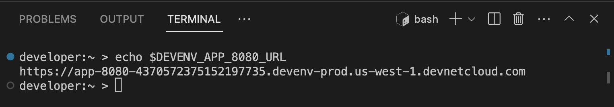
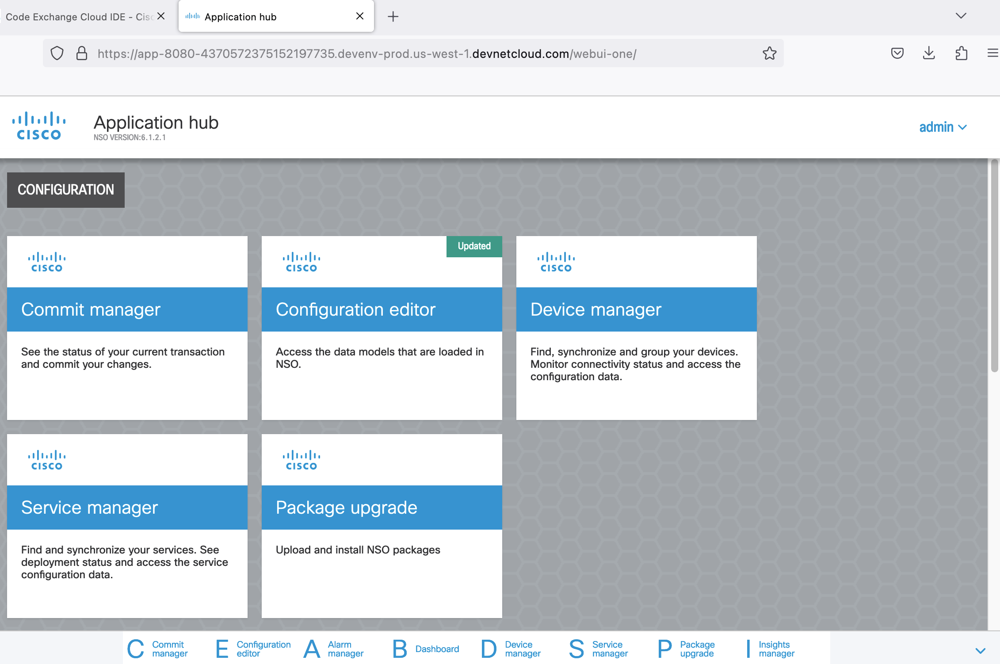

# Enable the NSO webUI

These steps apply for working with the NSO Playground using the system install variant.

### Configure ncs.conf

With `nano`, or `vi` edit the file `/etc/ncs/ncs.conf`

```diff
<webui>
  <enabled>true</enabled>
  <transport>
    <tcp>
-      <enabled>false</enabled>
+      <enabled>true</enabled>
      <ip>0.0.0.0</ip>
      <port>8080</port>
    </tcp>
  ...
</webui>
```

Enable local authentication still in the file `/etc/ncs/ncs.conf` you can omit this step if the user `admin` is present and has a password set.

> **_NOTE:_** If you are working with the official NSO container, [you can create the admin user with environment variables.](https://developer.cisco.com/docs/nso/guides/#!running-nso-in-containers/administration)

```diff
<local-authentication>
+  <enabled>false</enabled>
-  <enabled>true</enabled>
</local-authentication>
```

#### CLI alternative

If you prefer to update the `ncs.conf` file using the cli, use the following commands:

Enable the webUI.

```bash
sed -i.original -e "/<webui>/,/<\/webui>/ { /<transport>/,/<\/transport>/ { /<tcp>/,/<\/tcp>/ { /<enabled>/ s/false/true/ } } }" /etc/ncs/ncs.conf
```

Enable local authentication.

```bash
sed -i.backup -e "/<local-authentication>/{n;s|<enabled>false</enabled>|<enabled>true</enabled>|}" /etc/ncs/ncs.conf
```

### Reload NSO

After finishing editing the `ncs.conf` file, restart the ncs daemon.

```bash
ncs --reload
```

### Configure NSO

Add the minimum configuration required to enable access to the WebUI.

```bash
ncs_cli -Cu admin
config
load merge src/NSO-Playground-System-Install/webui/webUI.cfg
commit dry-run
commit and-quit
exit
```

> **_NOTE:_** You can also do: `load merge terminal` then paste the contents of [webUI.cfg,](webUI.cfg) use `ctrl + d` to exit and commit the configuration pasted.

#### CLI alternative

Or you can load and merge the contents of the `webUI.cfg` file in one go using `ncs_load`

```bash
ncs_load -F c -lm ~/src/NSO-Playground-System-Install/webui/webUI.cfg
```

### Access the webUI

Assuming you are using the default port 8080, you can obtain the URL from the `DEVENV_APP_8080_URL` environment variable in your terminal. The webUI default credentials are: `admin/admin`

```bash
echo $DEVENV_APP_8080_URL
```





If you're not sure which port to use, check the available environment variables with.

```bash
env | grep -i devenv_app
```

For more information about working with the official NSO container, look at [the NSO guide: Running NSO in containers.](https://developer.cisco.com/docs/nso/guides/#!running-nso-in-containers)
